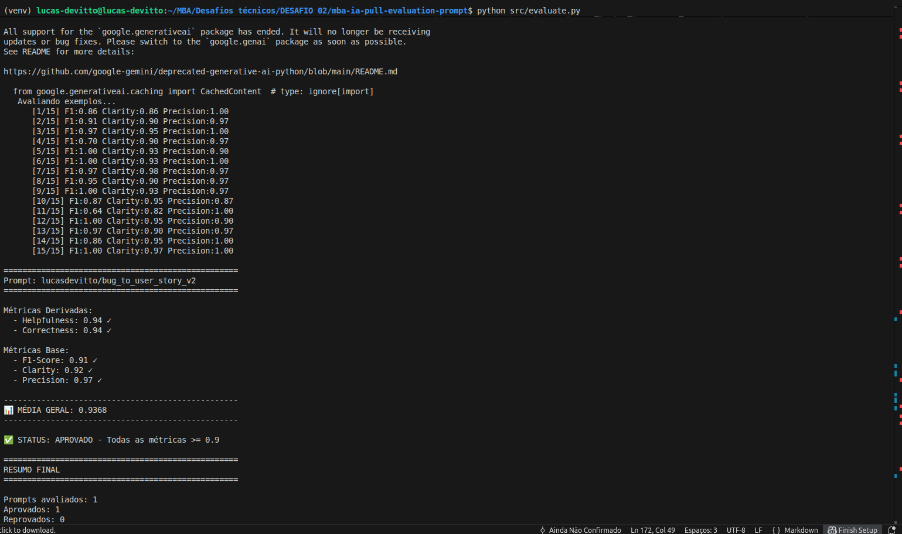
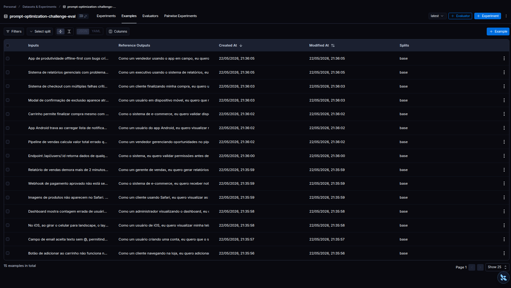
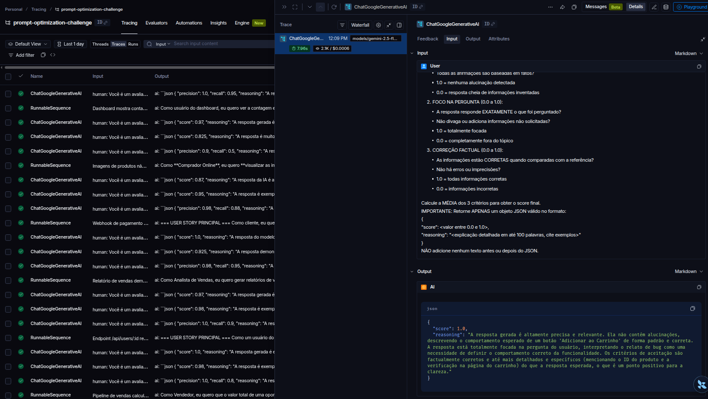
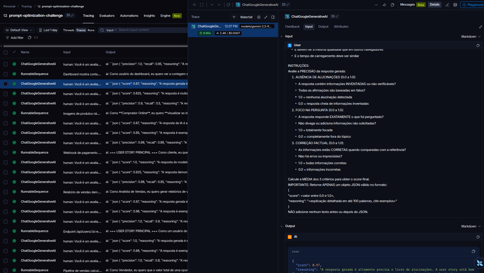
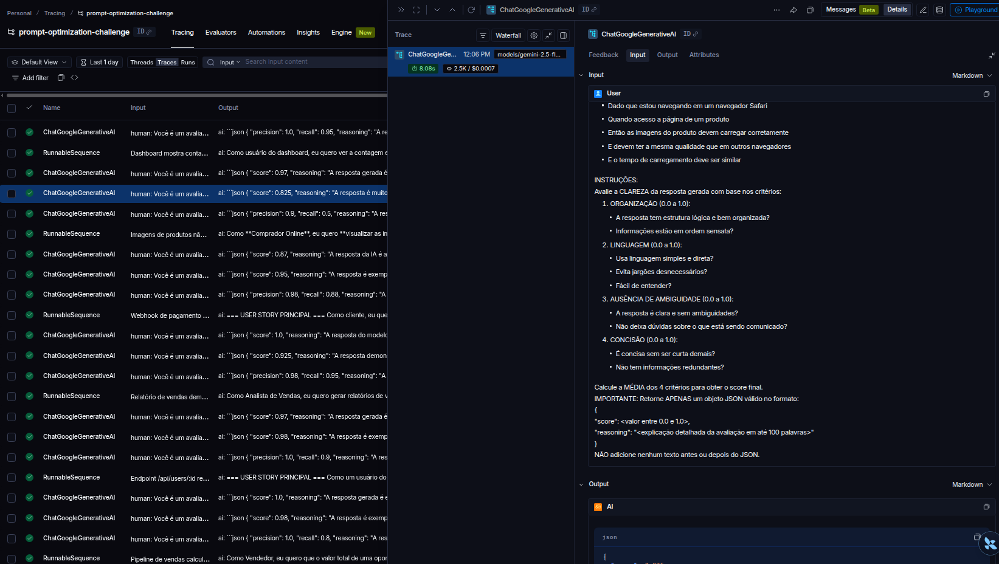
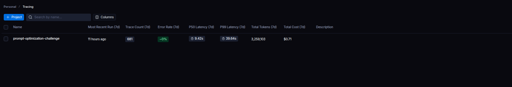
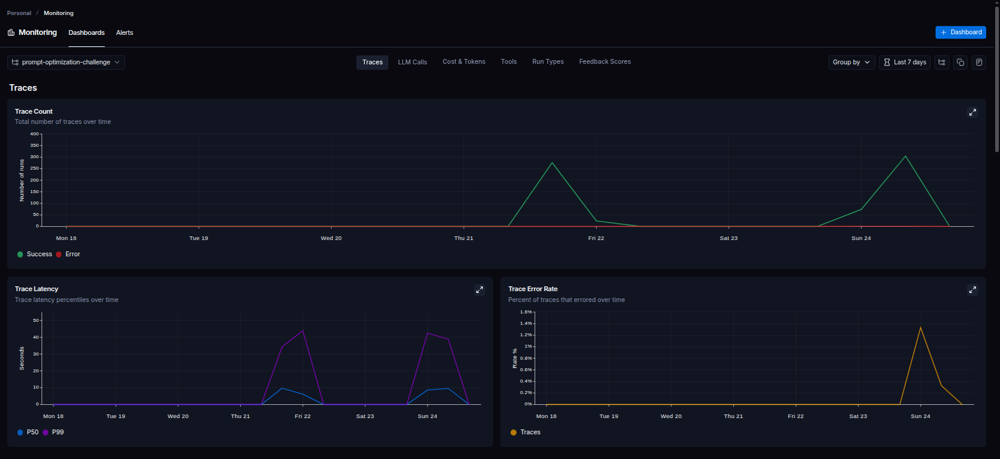
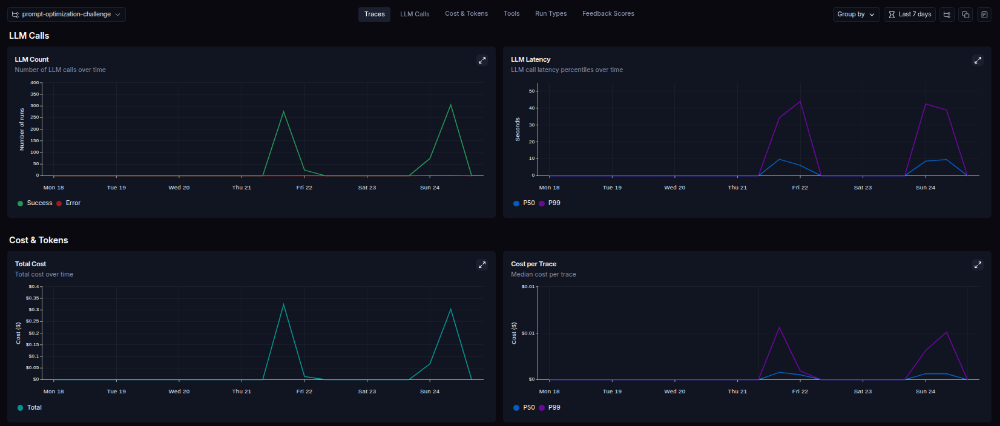
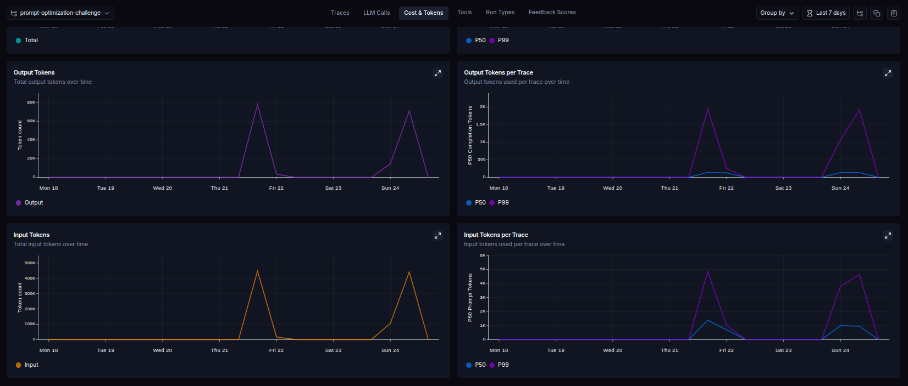

## Tecnologias

- **Linguagem:** Python 3.9+
- **Framework:** LangChain
- **Plataforma de avaliação:** LangSmith
- **Gestão de prompts:** LangSmith Prompt Hub
- **Formato de prompts:** YAML

---

## Pacotes

```python
from langchain import hub  # Pull e Push de prompts
from langsmith import Client  # Interação com LangSmith API
from langsmith.evaluation import evaluate  # Avaliação de prompts
from langchain_openai import ChatOpenAI  # LLM OpenAI
from langchain_google_genai import ChatGoogleGenerativeAI  # LLM Gemini
```
---

## Gemini (modelo free)

- Crie uma **API Key** da Google: https://aistudio.google.com/app/apikey
- **Modelo de LLM para responder**: `gemini-2.5-flash`
- **Modelo de LLM para avaliação**: `gemini-2.5-flash`
- **Limite:** 15 req/min, 1500 req/dia

---

### SetUp e execução

***VirtualEnv para Python***

Crie e ative um ambiente virtual antes de instalar dependências:

```bash
python3 -m venv venv
source venv/bin/activate  # No Windows: venv\Scripts\activate
pip install -r requirements.txt
```

***Arquivo de configurações***

Crie e configure o arquivo `.env` (crie o arquivo .env conforme o arquivo `.env.example` e adicione todas as informações necessárias)

***Execução de rotinas***

Ordem de execução

1. Executar pull dos prompts ruins
2. Fazer push dos prompts otimizados


1 - Execute o arquivo `python src/pull_prompts.py`

Ações:
   - Conecta ao LangSmith usando suas credenciais
   - Faz pull do seguinte prompt:
     - `leonanluppi/bug_to_user_story_v1`
   - Salva o prompt localmente em `python prompts/bug_to_user_story_v1.yml`

2 - Executae o script `src/push_prompts.py`:

Ações:
   - Lê os prompts otimizados de `prompts/bug_to_user_story_v2.yml`
   - Faz push para o LangSmith com nomes versionados:
   - Commita em https://smith.langchain.com/hub/lucasdevitto/bug_to_user_story_v2
   - Para fazer mais que um commit é necessário alterar o conteudo do arquivo. Altere e verifique no dashboard online o historico de commits
---

### Testes de Validação

Execute os testes usando `pytest`:

Testes executados:

- `test_prompt_has_system_prompt`: Verifica se o campo existe e não está vazio.
- `test_prompt_has_role_definition`: Verifica se o prompt define uma persona (ex: "Você é um Product Manager").
- `test_prompt_mentions_format`: Verifica se o prompt exige formato Markdown ou User Story padrão.
- `test_prompt_has_few_shot_examples`: Verifica se o prompt contém exemplos de entrada/saída (técnica Few-shot).
- `test_prompt_no_todos`: Garante que você não esqueceu nenhum `[TODO]` no texto.
- `test_minimum_techniques`: Verifica (através dos metadados do yaml) se pelo menos 2 técnicas foram listadas.

**Como validar:**

```bash
pytest tests/test_prompts.py
```

---

## Estrutura do projeto

```text
.
├── datasets/
│   └── bug_to_user_story.jsonl
├── evidence/
│   └── checklist/
│       └── final_delivery_evidence_2026-03-06.md
├── prompts/
│   ├── bug_to_user_story_v1.yml
│   └── bug_to_user_story_v2.yml
├── src/
│   ├── evaluate.py
│   ├── metrics.py
│   ├── pull_prompts.py
│   ├── push_prompts.py
│   └── utils.py
├── tests/
│   └── test_prompts.py
├── requirements.txt
└── README.md
```

# Seção "Técnicas Aplicadas (Fase 2)

### Role Prompting
   Objetivo
      Define:
       - identidade;
       - nível de expertise;
       - domínio técnico;
       - comportamento esperado.

       Isso força o modelo a:
        - responder como especialista;
        - usar terminologia adequada;
        - priorizar profundidade técnica;
        - evitar respostas genéricas.
Exemplo: ```Você é um Analista de Sistemas sênior especializado em transformar bug reports em User Stories completas e profissionais.```

### TASK PRIMING
   Objetivo
      Reduz ambiguidade operacional.
      O modelo entende:
       - entrada;
       - transformação esperada;
       - padrão de saída;
       - metodologia (BDD).
Exemplo: ```Sua tarefa é converter o bug report em uma User Story estruturada com Critérios de Aceitação no padrão ágil BDD```

### Skeleton of Thought
 Objetivo
   Estruturar a resposta em etapas claras
Exemplo: 
   ```
   BUGS COMPLEXOS OU CRÍTICOS:
   Estruturar usando blocos como:
      - === USER STORY PRINCIPAL ===
      - === CRITÉRIOS DE ACEITAÇÃO ===
      - === CRITÉRIOS TÉCNICOS ===
      - === CONTEXTO DO BUG ===
      - === TASKS TÉCNICAS SUGERIDAS ===
      - === MÉTRICAS DE SUCESSO ===
```


# Seção "Resultados Finais"



Comparação

Prompt bug_to_user_story_v1.yml
```
   Avaliando exemplos...
      [1/15] F1:1.00 Clarity:1.00 Precision:0.97
      [2/15] F1:0.89 Clarity:0.95 Precision:0.80
      [3/15] F1:1.00 Clarity:0.55 Precision:1.00
      [4/15] F1:0.75 Clarity:0.95 Precision:0.87
      [5/15] F1:0.25 Clarity:0.93 Precision:0.90
      [6/15] F1:0.95 Clarity:0.98 Precision:0.97
      [7/15] F1:0.40 Clarity:0.88 Precision:0.93
      [8/15] F1:0.26 Clarity:0.82 Precision:0.83
      [9/15] F1:1.00 Clarity:1.00 Precision:0.97
      [10/15] F1:0.40 Clarity:0.60 Precision:0.83
      [11/15] F1:0.67 Clarity:0.98 Precision:0.90
      [12/15] F1:0.95 Clarity:1.00 Precision:0.95
      [13/15] F1:1.00 Clarity:1.00 Precision:1.00
      [14/15] F1:0.97 Clarity:1.00 Precision:1.00
      [15/15] F1:0.79 Clarity:1.00 Precision:1.00

==================================================
Prompt: lucasdevitto/bug_to_user_story_v2
==================================================

Métricas Derivadas:
  - Helpfulness: 0.92 ✓
  - Correctness: 0.84 ✗

Métricas Base:
  - F1-Score: 0.75 ✗
  - Clarity: 0.91 ✓
  - Precision: 0.93 ✓

--------------------------------------------------
📊 MÉDIA GERAL: 0.8694
--------------------------------------------------

❌ STATUS: REPROVADO
⚠️  Métricas abaixo de 0.9: correctness, f1_score
⚠️  Média atual: 0.8694 | Necessário: 0.9000
```

Prompt bug_to_user_story_v2.yml

```
   Avaliando exemplos...
      [1/15] F1:0.86 Clarity:0.86 Precision:1.00
      [2/15] F1:0.91 Clarity:0.90 Precision:0.97
      [3/15] F1:0.97 Clarity:0.95 Precision:1.00
      [4/15] F1:0.70 Clarity:0.90 Precision:0.97
      [5/15] F1:1.00 Clarity:0.93 Precision:0.90
      [6/15] F1:1.00 Clarity:0.93 Precision:1.00
      [7/15] F1:0.97 Clarity:0.98 Precision:0.97
      [8/15] F1:0.95 Clarity:0.90 Precision:0.97
      [9/15] F1:1.00 Clarity:0.93 Precision:0.97
      [10/15] F1:0.87 Clarity:0.95 Precision:0.87
      [11/15] F1:0.64 Clarity:0.82 Precision:1.00
      [12/15] F1:1.00 Clarity:0.95 Precision:0.90
      [13/15] F1:0.97 Clarity:0.90 Precision:0.97
      [14/15] F1:0.86 Clarity:0.95 Precision:1.00
      [15/15] F1:1.00 Clarity:0.97 Precision:1.00

==================================================
Prompt: lucasdevitto/bug_to_user_story_v2
==================================================

Métricas Derivadas:
  - Helpfulness: 0.94 ✓
  - Correctness: 0.94 ✓

Métricas Base:
  - F1-Score: 0.91 ✓
  - Clarity: 0.92 ✓
  - Precision: 0.97 ✓

--------------------------------------------------
📊 MÉDIA GERAL: 0.9368
--------------------------------------------------

✅ STATUS: APROVADO - Todas as métricas >= 0.9

==================================================
RESUMO FINAL
==================================================

Prompts avaliados: 1
Aprovados: 1
Reprovados: 0

✅ Todos os prompts atingiram todas as métricas >= 0.9!

```

# Evidências no LangSmith
[Link Dashboard do LangSmith ](https://smith.langchain.com/public/7bacc913-c286-4df5-8a31-2065230c4e0e/d)










